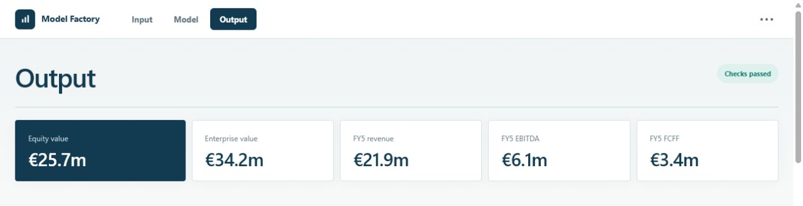
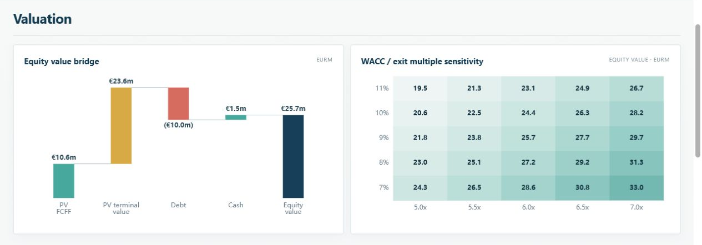
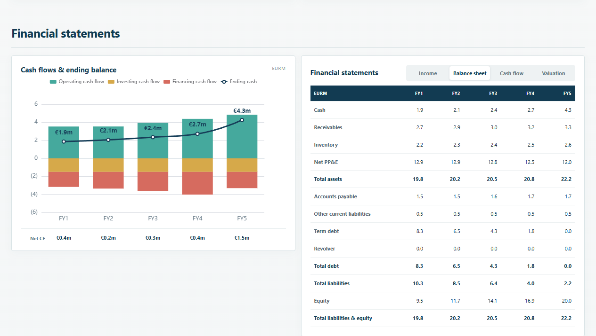
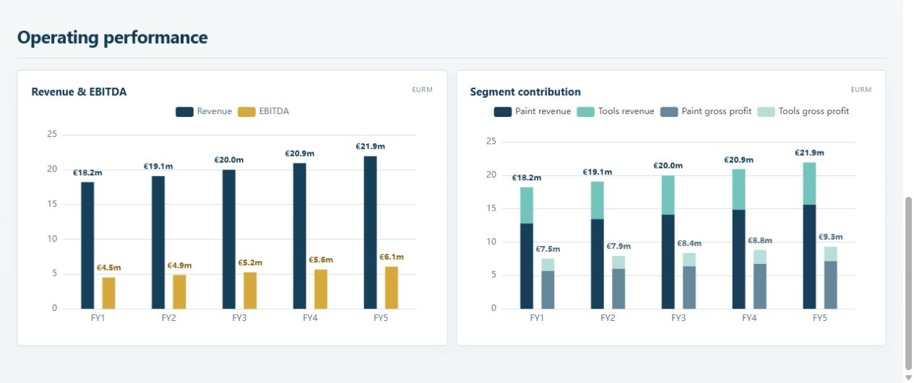
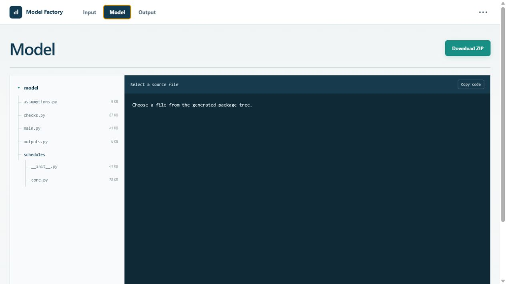
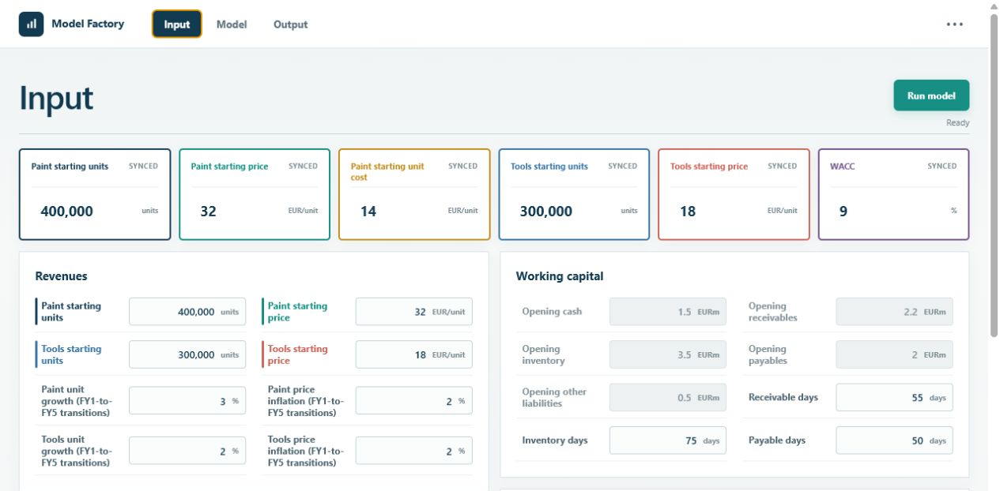
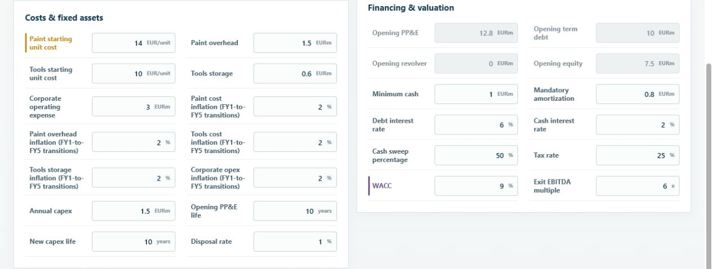
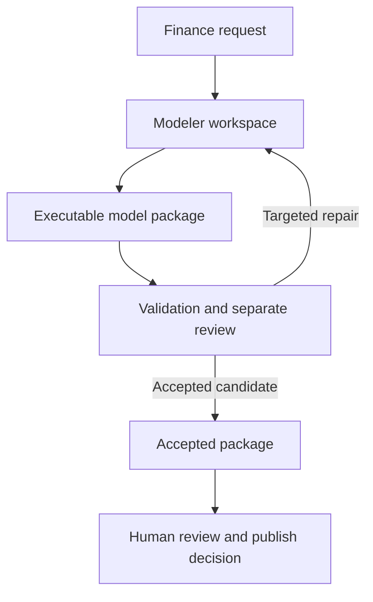

# Model Factory

[](https://github.com/cedricvanhoeserlande/financial-model-factory/actions/workflows/ci.yml)

### From a finance problem to an inspectable Python model package

**Model Factory** explores how AI-generated financial models can become
inspectable, executable, testable, and reviewable software artifacts - not
one-off spreadsheets or opaque code responses.

It turns a finance request into a structured specification and a model-specific
Python package, executes the package, challenges it with deterministic checks
and input stress tests, and sends material issues through a separate
review-and-repair loop before a human decides whether the result is usable.

## Executed example

This repository includes an accepted end-to-end run for a fictional
paint-manufacturing and tools-distribution company. The result is a complete,
internally reconciled synthetic financial model covering two revenue streams,
working capital, PP&E, term debt and revolver mechanics, integrated financial
statements, cash flow, and an exit-multiple FCFF valuation.

The generated Python package, model-specific checks, and repair history came
through the Model Factory workflow. The polished dashboard below was designed
separately for this case as a showcase presentation layer; it does not replace
or alter the generated model mechanics.

### Output

Inspect valuation, linked statements, cash generation, operating performance,
and current model-check status.






### Model

Browse the generated Python package, inspect its source, or download the
sanitized model.



### Input

Change explicit model drivers with defined units and bounds, then rerun the
accepted package locally.




## How the factory works



The Modeler works inside a restricted package workspace where it can inspect,
edit, execute, and validate permitted artifacts. Parser, runtime, contract,
stress-test, and review findings return as evidence for targeted repairs. A
package is admitted only when a fresh deterministic gate receipt matches the
actual workspace state.

## Architecture at a glance

| Layer | Responsibility |
| --- | --- |
| **React / TypeScript UI** | Input editing, source inspection, statements, checks, and the curated showcase |
| **Python orchestration** | Workflow state, package execution, contracts, model registry, and local HTTP API |
| **Restricted Modeler workspace** | Model-specific file construction, targeted edits, execution, and validation |
| **Validation and review** | Deterministic gates, input stress tests, mechanical checks, and a separate Review Agent |
| **Generated model package** | Specification, assumptions, schedules, checks, outputs, and execution contract |

Technical detail is available in the
[architecture](docs/architecture.md), [workflow](docs/workflow.md),
[model contracts](docs/model-contracts.md), and
[validation and review](docs/validation-and-review.md) documentation.

## Evidence you can inspect

- The [curated paint example](examples/paint_showcase/README.md) contains the
  accepted model package, structured specification, equation graph, thesis,
  model-local tests, and manual acceptance notes.
- Input stress tests vary material operating, financing, and valuation drivers
  before acceptance; deterministic and Review Agent evidence records the issues
  found and the bounded repairs applied.
- A committed [local-rerun record](examples/paint_showcase/rerun_evidence.json)
  shows an assumption change updating valuation while the accepted package
  preserves its checks—without another OpenAI call.

## What the review process caught

Two evidence-driven repair rounds strengthened the accepted package before
approval:

- Input stress-test results were bound to the exact submitted raw inputs,
  closing a gap where plausible outputs could previously pass without proving
  the correct input/output pairing.
- Minimum-cash headroom evidence was clarified so a zero balance is treated as
  a binding liquidity limit rather than a failed reconciliation.
- PP&E test coverage was expanded to prove that the declared zero-book-value
  disposal convention leaves depreciation, earnings, cash flow, and FCFF
  unchanged.

The complete findings, amendments, and subsequent approvals remain available in
the [review history](examples/paint_showcase/model_package/reports/review_history.json)
and [final review report](examples/paint_showcase/model_package/reports/review_report.json).

## Run the showcase locally

Prerequisites: Python 3.11+ and Node.js 22.12+.

```powershell
git clone https://github.com/cedricvanhoeserlande/financial-model-factory.git
cd financial-model-factory
python -m pip install -r requirements.txt
cd frontend
npm ci
npm run build
cd ..
python run_local.py --host 127.0.0.1 --port 8782
```

Open `http://127.0.0.1:8782/showcase/paint`. The committed showcase and its
verification path run without API credentials or live AI calls.

## Experimental boundary

Model Factory is a portfolio prototype, not an investment-grade system or an
autonomous replacement for professional financial review. The accepted example
demonstrates the implemented workflow and evidence boundary; it does not prove
that arbitrary generated models are economically suitable. See the full
[limitations](docs/limitations.md).

License: [Portfolio Evaluation License 1.0](LICENSE). Third-party notices are
available in [THIRD_PARTY_NOTICES.md](THIRD_PARTY_NOTICES.md).
